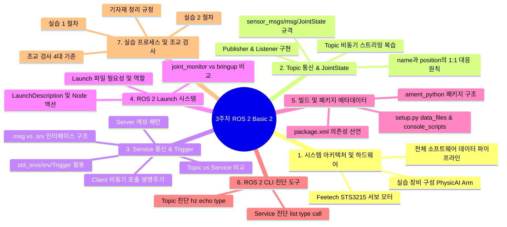
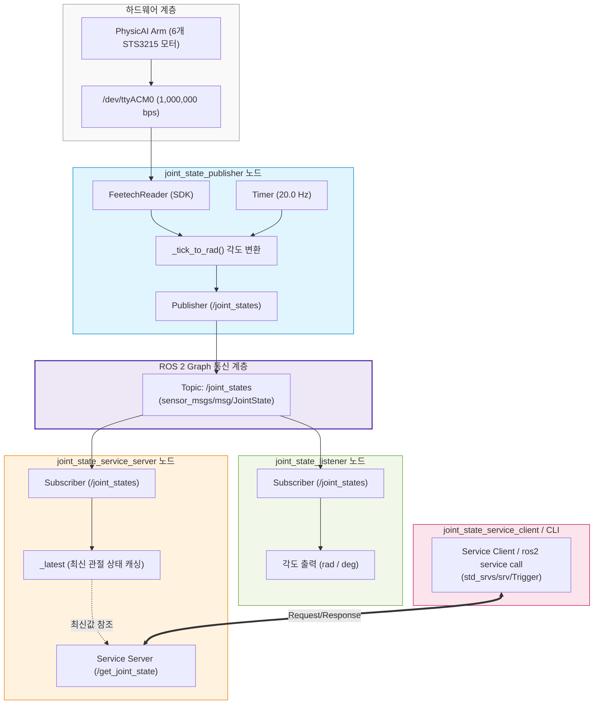
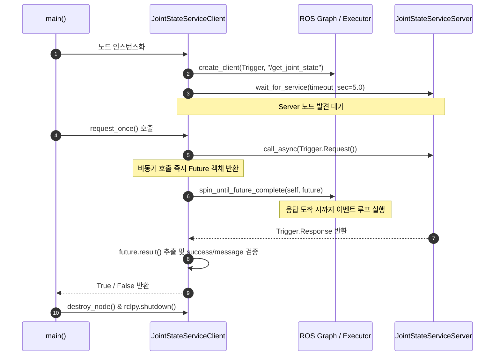

# [3주차] ROS 2 Basic 2 — 핵심 이론 및 실습 MECE 총정리

> **강의 자료**: `week3_ROS2_basic2.pptx` 및 `lecture.md`, `practice.md` 기반  
> **정리 원칙**: **MECE (Mutually Exclusive, Collectively Exhaustive)** 원칙을 적용하여 상호 중복 없이 3주차에 다룬 모든 이론과 실습 개념을 체계적으로 포괄함.

---

## 📌 전체 구성 체계 (MECE Framework)



---

## 1. 시스템 아키텍처 및 실습 장비 구성

### 1.1 실습 장비 구성 (Hardware Layer)
- **PhysicAI Arm**: 6자유도(DOF) 로봇 매니퓰레이터
- **스마트 액추에이터**: Feetech STS3215 버스 서보 모터 6개
  - Resolution: 4096 ticks/rev (Center tick: 2048)
  - 통신 방식: Half-duplex 시리얼 통신 (`/dev/ttyACM0`, Baudrate: 1,000,000 bps)
- **컴퓨팅 유닛**: NVIDIA Jetson 보드 (Ubuntu Linux 환경)
- **연결 매개체**: USB-to-TTL 시리얼 컨버터를 통해 Jetson과 액추에이터 버스 연결

### 1.2 전체 소프트웨어 통신 파이프라인 (Software Architecture)



> [!IMPORTANT]
> **시리얼 포트 단일 점유 원칙**:
> `/dev/ttyACM0` 시리얼 포트는 운영체제 상에서 단 하나의 프로세스만 점유하여 열 수 있습니다. 따라서 Service Server는 모터 장치를 직접 열지 않고, Publisher가 발행하는 `/joint_states` Topic을 구독하여 최신값을 메모리에 캐싱한 뒤 요청 시 반환하도록 설계되었습니다.

---

## 2. Topic 통신과 `JointState` 인터페이스

### 2.1 Topic 통신의 특성
- **패러다임**: 단방향(One-Way) 비동기 퍼블리시-서브스크라이브 패턴
- **데이터 성격**: 주기적이고 연속적으로 상태가 갱신되는 센서/관절 스트리밍 데이터에 적합
- **다대다 관계**: 1:N, N:N 통신이 가능하여 여러 노드가 동시에 상태를 구독할 수 있음

### 2.2 `sensor_msgs/msg/JointState` 표준 인터페이스
ROS 2에서 로봇 관절의 기구학적 상태를 공유하기 위해 정의된 표준 인터페이스입니다.

```text
std_msgs/Header header   # 메시지 생성 타임스탬프 (stamp) 및 프레임 ID
string[] name            # 관절 이름 배열
float64[] position       # 관절 각도 배열 (radian 단위)
float64[] velocity       # 관절 각속도 배열 (rad/s) - 이번 실습 미사용 []
float64[] effort         # 관절 토크/힘 배열 (Nm) - 이번 실습 미사용 []
```

### 2.3 `name`과 `position` 배열의 1:1 매핑 규칙
- `name[i]`의 관절 각도는 정확히 `position[i]`에 대응해야 합니다.
- **배열 길이 불일치 검사**: 수신측에서는 두 배열의 길이가 다를 경우 데이터 오염으로 판단하고 경고(Warning)를 출력해야 합니다.
- **관절 인덱스 순서 (6 DOF)**:
  1. `shoulder_pan`
  2. `shoulder_lift`
  3. `elbow_flex`
  4. `wrist_flex`
  5. `wrist_roll`
  6. `gripper`

---

## 3. Service 통신과 Request-Response 패턴

### 3.1 Topic vs Service 비교 (MECE 분석)

| 비교 항목 | Topic 통신 | Service 통신 |
|---|---|---|
| **통신 흐름** | 단방향 비동기 스트리밍 (Publisher ➡️ Subscriber) | 양방향 요청-응답 트랜잭션 (Client ⇄ Server) |
| **호출 시점** | 타이머/이벤트에 의해 주기적 지속 발행 | Client가 필요할 때 1회 호출 |
| **관계** | 1:N, N:N 브로드캐스트 | 1:1 동기/비동기 요청-응답 |
| **인터페이스** | `.msg` 파일 (단일 데이터 구조) | `.srv` 파일 (Request와 Response 구분) |
| **실습 적용** | `/joint_states` (관절 상태 20Hz 스트리밍) | `/get_joint_state` (최신 관절값 1회성 스냅샷 조회) |
| **적합한 용도** | 센서 데이터 스트리밍, 주기적 상태 공유 | 파라미터 변경, 작업 실행 명령, 특정 상태 조회 |

### 3.2 `.msg` vs `.srv` 인터페이스 규격
- **`.msg`**: 한 방향으로 전송되는 단일 데이터 구조
- **`.srv`**: `---` (대시 세 개)를 경계로 위쪽은 Client가 보내는 **Request**, 아래쪽은 Server가 돌려주는 **Response**를 정의함.

### 3.3 `std_srvs/srv/Trigger` 표준 서비스
이번 실습에서는 별도의 커스텀 인터페이스를 만들지 않고 ROS 2 표준 패키지의 `Trigger` 인터페이스를 재활용합니다.

```text
---             # Request 영역 (비어 있음 -> 호출 자체가 트리거 신호)
bool success    # Response 영역: 처리 성공 여부 (True / False)
string message  # Response 영역: 결과 데이터 문자열 또는 에러 사유
```

- **Request**: 전달할 인자 없이 빈 요청 `Trigger.Request()`를 전송.
- **Response**:
  - 정상 처리 시: `success = True`, `message = "관절 각도 문자열"`
  - 미수신/실패 시: `success = False`, `message = "아직 관절 상태를 수신하지 못했습니다."`

### 3.4 Service Client의 비동기 호출 라이프사이클



---

## 4. ROS 2 Launch 시스템

### 4.1 Launch 시스템의 필요성
- 여러 개의 노드를 실행할 때 터미널을 개별적으로 열어 `ros2 run`을 반복 실행해야 하는 비효율성을 제거합니다.
- 패키지 내 여러 노드의 파라미터, 실행 설정, 로그 출력 옵션을 하나의 Python 스크립트로 묶어 단일 명령어로 시작하고 `Ctrl + C`로 일괄 종료합니다.

### 4.2 주요 구성 요소
- `generate_launch_description()`: `ros2 launch` 실행 시 진입점이 되는 필수 함수
- `LaunchDescription`: 실행할 액션들의 리스트를 담는 컨테이너
- `Node(package=..., executable=..., name=..., output="screen")`: 실행할 프로세스 정의

### 4.3 실습 1 vs 실습 2 Launch 비교

| 구분 | [실습 1] `joint_monitor.launch.py` | [실습 2] `bringup.launch.py` |
|---|---|---|
| **실행 노드 1** | `joint_state_publisher` | `joint_state_publisher` |
| **실행 노드 2** | `joint_state_listener` | `joint_state_service_server` |
| **주요 목적** | Topic 발행과 실시간 수신 화면 모니터링 | 하드웨어 발행과 서비스 서버 백그라운드 구동 |
| **클라이언트** | 자동 수신 (Subscriber 콜백) | 별도 터미널에서 필요 시 Client 실행 |

---

## 5. 빌드 시스템 및 패키지 메타데이터 (`ament_python`)

### 5.1 패키지 디렉토리 레이아웃
```text
week03_ros2_jetson/
├── config/
│   └── joints.yaml              # 관절 ID, 영점, 통신 속도, publish_hz
├── launch/
│   ├── bringup.launch.py        # 실습 2용 런치
│   └── joint_monitor.launch.py  # 실습 1용 런치
├── resource/
│   └── week03_ros2_jetson       # ament 패키지 식별 마커 파일
├── week03_ros2_jetson/
│   ├── __init__.py
│   ├── hardware_interface.py    # 서보 SDK 연결 및 각도 변환
│   ├── joint_state_publisher.py # Topic 발행 노드
│   ├── joint_state_listener.py  # Topic 수신 노드
│   ├── joint_state_service_server.py # Service 서버 노드
│   └── joint_state_service_client.py # Service 클라이언트 노드
├── package.xml                  # ROS 2 의존성 및 패키지 메타데이터
├── setup.cfg                    # 실행 스크립트 설치 경로 설정
└── setup.py                     # Python 패키지 설치 및 진입점 등록
```

### 5.2 `setup.py` 필수 설정
```python
from glob import glob
import os
from setuptools import find_packages, setup

package_name = "week03_ros2_jetson"

setup(
    name=package_name,
    version="0.0.0",
    packages=find_packages(exclude=["test"]),
    data_files=[
        ("share/ament_index/resource_index/packages", ["resource/" + package_name]),
        ("share/" + package_name, ["package.xml"]),
        (os.path.join("share", package_name, "config"), glob("config/*.yaml")),
        (os.path.join("share", package_name, "launch"), glob("launch/*.launch.py")),
    ],
    install_requires=["setuptools", "PyYAML"],
    entry_points={
        "console_scripts": [
            "joint_state_publisher = week03_ros2_jetson.joint_state_publisher:main",
            "joint_state_listener = week03_ros2_jetson.joint_state_listener:main",
            "joint_state_service_server = week03_ros2_jetson.joint_state_service_server:main",
            "joint_state_service_client = week03_ros2_jetson.joint_state_service_client:main",
        ],
    },
)
```

---

## 6. ROS 2 CLI 진단 도구 요약

| 진단 목적 | 명령어 | 정상 기대 결과 예시 |
|---|---|---|
| **실행 노드 확인** | `ros2 node list` | `/joint_state_publisher`<br>`/joint_state_service_server` |
| **Topic 타입 확인** | `ros2 topic type /joint_states` | `sensor_msgs/msg/JointState` |
| **Topic 주기 검사** | `ros2 topic hz /joint_states` | `average rate: 20.0xx Hz` |
| **Topic 데이터 확인** | `ros2 topic echo --once /joint_states` | 6개 name과 position 각도값 출력 |
| **Service 목록 확인** | `ros2 service list` | `/get_joint_state` |
| **Service 규격 확인** | `ros2 service type /get_joint_state` | `std_srvs/srv/Trigger` |
| **Service 인터페이스 필드** | `ros2 interface show std_srvs/srv/Trigger` | `---`<br>`bool success`<br>`string message` |
| **Service CLI 직접 호출** | `ros2 service call /get_joint_state std_srvs/srv/Trigger "{}"` | `success=True`<br>`message='shoulder_pan=...'` |

---

## 7. 실습 수행 절차 및 조교 검사 기준

### 7.1 단계별 실습 수행 플로우

```text
[0단계] 환경 점검 ──> source ~/ros2_base/install/setup.bash 및 ls -l /dev/ttyACM0
      │
[1단계] 패키지 빌드 ──> colcon build --symlink-install --packages-select week03_ros2_jetson
      │
[2단계] 실습 1 검증 ──> ros2 launch week03_ros2_jetson joint_monitor.launch.py
      │                 (Topic hz 약 20Hz 및 6개 관절 각도 출력 확인)
      │
[3단계] 실습 2 검증 ──> ros2 launch week03_ros2_jetson bringup.launch.py 실행 후
      │                 ros2 run week03_ros2_jetson joint_state_service_client 실행
      │
[4단계] 조교 평가 ───> 4대 핵심 기준 시연 및 검사 승인
      │
[5단계] 정리 및 종료 ─> 프로세스 Ctrl+C 종료, 기자재 원 비닐팩 포장 및 정리
```

### 7.2 조교 최종 검사 4대 판정 기준 (Evaluation Criteria)

1. **노드 정상 구동 여부**: Bringup 런치 실행 후 `ros2 node list`에서 Publisher와 Service Server 노드가 동시에 검색되는가?
2. **Topic 규격 및 발행 속도**: `/joint_states`의 인터페이스가 `sensor_msgs/msg/JointState`이고, 약 20 Hz 주기로 발행되는가?
3. **Service 규격 적합성**: `/get_joint_state`의 타입이 `std_srvs/srv/Trigger`로 조회되는가?
4. **최신 데이터 수신 여부**: Python Client와 ROS 2 CLI 모두에서 최신 6개 관절의 radian/degree 각도값을 `success=True`로 정상 수신하는가?
